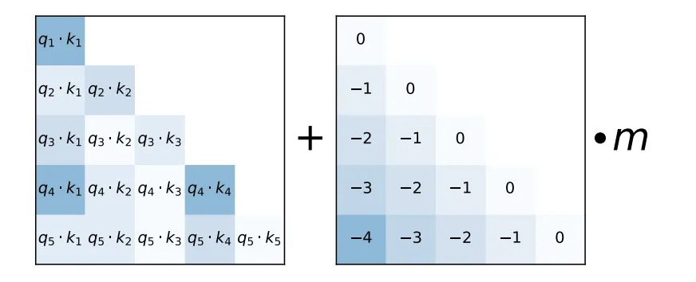

# Attention with Linear Biases

[Attention with Linear Biases ](https://ofir.io/train_short_test_long.pdf) (ALiBi)
does not add positional embeddings
to word embeddings; instead, it biases query-key attention scores with a penalty
that is proportional to their distance.
ALiBi is defined as:

$$
\{softmax}\left(\mathbf{q}_i \mathbf{K}^{\top}+m \cdot[-(i-1), \ldots,-2,-1,0]\right)
$$




The figrue offers a visualization.
ALiBi adds a constant bias (right) to each attention score ($\mathbf{q}_i \cdot \mathbf{k}_j$, left). m is a head-specific scalar that is set and not learned throughout training. 
The following code shows the calculation process.

```python
alibi_mask = _fill_with_neg_inf(torch.zeros([seqlen_q, seqlen_kv], dtype=data_type))
for i in range(seqlen_q-1, -1, -1):
    for j in range(seqlen_kv):
        mask = j - seqlen_kv + 1 + (seqlen_q - 1 - i)
        if mask <= 0:
            alibi_mask[i][j] = mask
alibi_mask = alibi_mask.unsqueeze(0).expand(num_heads, -1, -1) 
# alibi_mask shape -> (num_heads, seqlen_q, seqlen_kv)
# slopes_m shape -> (num_heads, 1, 1)
alibi_mask = slopes_m * alibi_mask
```

## Attributes/Parameters

### `num_heads`: int

Number of heads

### `data_type`: str

Data type of ALiBi mask

## Inputs

### `seqlen_q`: tensor(int64)

Length of query tensor.

Shape: scalar

### `seqlen_kv`: tensor(int64)

Length of key/values tensor.

Shape: scalar

### `attn_mask`(optional): tensor(T)

Optional custom mask. If shape is $(seqlen\\_q, seqlen\\_kv)$, `attn_mask` will be broadcasted.

Shape: $(seqlen\\_q, seqlen\\_kv)$ or $(batch, num\\_heads, seqlen\\_q, seqlen\\_kv)$

## Outputs

### `alibi_mask`: tensor(T)

Output mask of ALiBi.
Shape: $(num\\_heads, seqlen\\_q, seqlen\\_kv)$ or $(batch, num\\_heads, seqlen\\_q, seqlen\\_kv)$


## Type Constraints

### `T`: float32, float16
